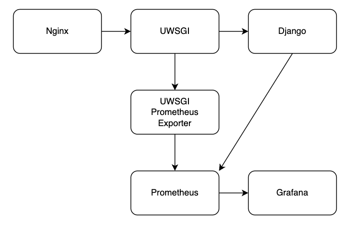

# Monitoring Django apps

This is a simple example app showcasing how to monitor a Django app with Prometheus,
when app is running behind UWSGI and Nginx. Grafana is used for dashboard. The whole
stack is running on Docker.


## Prerequisites
- [Docker](https://docs.docker.com/get-docker/)
- [Docker Compose](https://docs.docker.com/compose/install/)
- [K6](https://k6.io/docs/getting-started/installation/) (optional, required for load testing)


## Running
In the project root, run the following command. `--build` flag is optional, but might
be required if you make changes to the project between runs:

```
docker-compose up [--build]
```

This will start five Docker containers: 
| Name           | Description                   |
| -------------- | ----------------------------- |
| app            | Django application            |
| uwsgi          | uWSGI                         |
| nginx          | Nginx HTTP server             |
| prometheus     | Prometheus monitoring system  |
| uwsgi_exporter | uWSGI metric exporter         |

You can stop the stack with `Ctrl+C`.

Apps are now available in the following ports:
| Name           | URL                           |
| -------------- | ----------------------------- |
| Django app     | http://localhost:8000         |
| Prometheus     | http://localhost:9090         |
| Grafana        | http://localhost:3000         |

### Using example Grafana dashboard
By default, Grafana does not have any dashboards but you can use the provided example.

- Add a new Datasource. Call it Prometheus and use URL `http://prometheus:9090`
- Go back to datasource configuration and get the data source ID from the URL
- Create a new empty dashboard
- Go to Dashboard settings -> JSON Model and paste the content from [dashboard.json](grafana/dashboard.json)
- Run find-and-replace and replace `Aa93neR4k` with your Prometheus data source ID.

## How it works
Project is using the standard Nginx -> uWSGI -> Django stack. This is explained in more detail in the [uWSGI documentation](https://uwsgi-docs.readthedocs.io/en/latest/tutorials/Django_and_nginx.html).

Prometheus is running as a standalone app. It works by **pulling** metrics from different places - called targets. Targets are just HTTP endpoints (or sockets) that provide the metrics in specific format.

In this project there are two targets. Django application provides the metrics in http://localhost:8000/metrics. For this, [django-prometheus](https://github.com/korfuri/django-prometheus) package is used. It makes it very easy to export HTTP, database and model metrics from the Django app.

Another target is `uwsgi-exporter` container, which is running in http://localhost:9117/metrics. uWSGI does have it's own metrics endpoint, but it is not compatible with Prometheus so `uwsgi-exporter` helps with that by working between uWSGI and Prometheus. This way we can get metrics from uWSGI workers.

Prometheus provides some dashboard capabilities, but to make really fancy dashboards, Grafana is used. Basically, Grafana is fetching the data from Prometheus and visualizes them.



### Database and model metrics
Django-prometheus package makes it really easy to get metrics from the database and from models. Everything is explained in the [README](https://github.com/korfuri/django-prometheus) but here is the short summary.

To get database metrics, all you need to do is to change the `ENGINE` in the Django app configuration. For example, if you are using `django.db.backends.sqlite3` replace it with `django_prometheus.db.backends.sqlite3`. Now database metrics are available.

For models, you need to make your models to extends `ExportModelOperationsMixin("model_name")` class. `model_name` is the name that is used in the metrics to identify the model. Check [Dog](my_app/dogs/models.py) and [Cat](my_app/cats/models.py) for an example.


## Load testing
This project also includes a load testing example with `K6`.

To run the test, first run `docker-compose` in the project root:
```
docker-compose up [--build]
```

Then, in another terminal go to `k6` directory and run the following command
```
k6 run --vus 1 --duration 5s load_test.js
```

This will run a 5 second load testing using just one virtual user.
If you want to bombard the system properly, you can use a load test that will increase virtual
users ever 15 seconds until there are 160 users.
```
k6 run --vus 5 --stage 15s:10,15s:20,15s:40,15s:80,2m:160 load_test.js
```

This will quite likely make your local stack to choke, but it is also a good way to see the
changes in the dashboard.